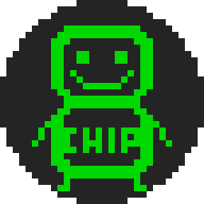

# Chip8

A Chip 8 interpreter written in Python.

## Using Chip8

### Windows
Just double-click the Chip8.exe.

### Linux
Find the Chip8 file and double-click it.  
If this doesn't work you have to give the pylette file executable permission.  
You can do this with `chmod +x /path/to/Chip`.
I would also recommend you to create a .desktop file so you can open it with an application icon and the ability to start it outside the directory of the executable.

### MacOs
I don't have a Mac; if there is enough demand I may look into options to make an executable.

## Creating executables
1. run `pyinstaller -y -w -i "path/to/Chip8Boy.ico" "path/to/main.py"`
2. rename the main(.exe) to Chip8(.exe) 

## Requirements
* Written in Python 3.7.2 but should work down to Python 3.6
* PySide2 v5.13.1
* Pygame v1.9.6
* PyInstaller v3.5
